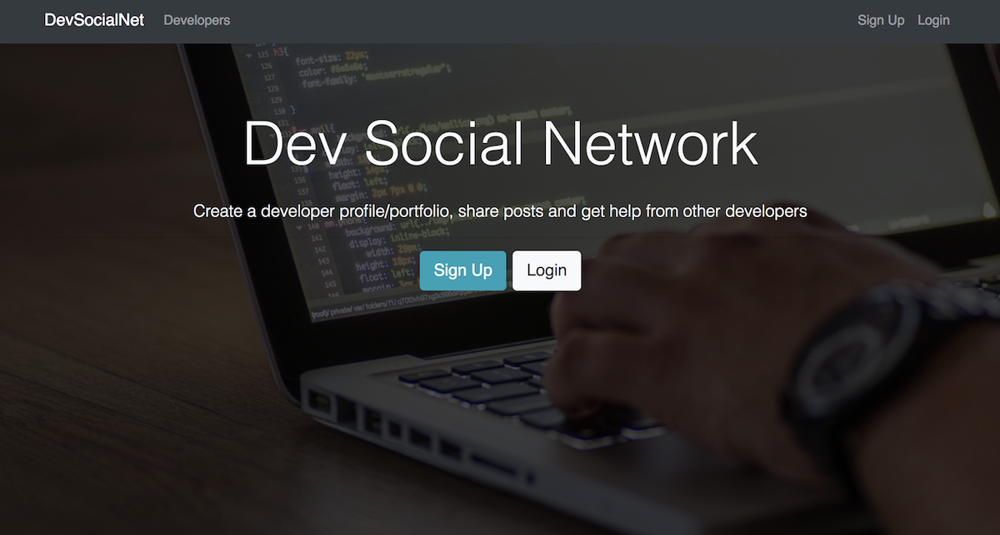

# Dev Social Net

This is a social network app built using the MERN stack (MongoDB, Express, React, Redux, Node.js), as part of a build-along class through Udemy.com. Scrolllll down for install instructions. Deployed to Heroku [here](https://devsocialnet.herokuapp.com/).

## Getting started

### Installing dependencies

Navigate to directory from command line.

To install server dependences:
`npm install`

To install client dependencies:
`npm run client-install`

### Starting the client/server

To run both client and server with [concurrently](https://github.com/kimmobrunfeldt/concurrently):
`npm run dev`

To run Express server independently:
`npm run server`

To run React client independently:
`npm run client`
